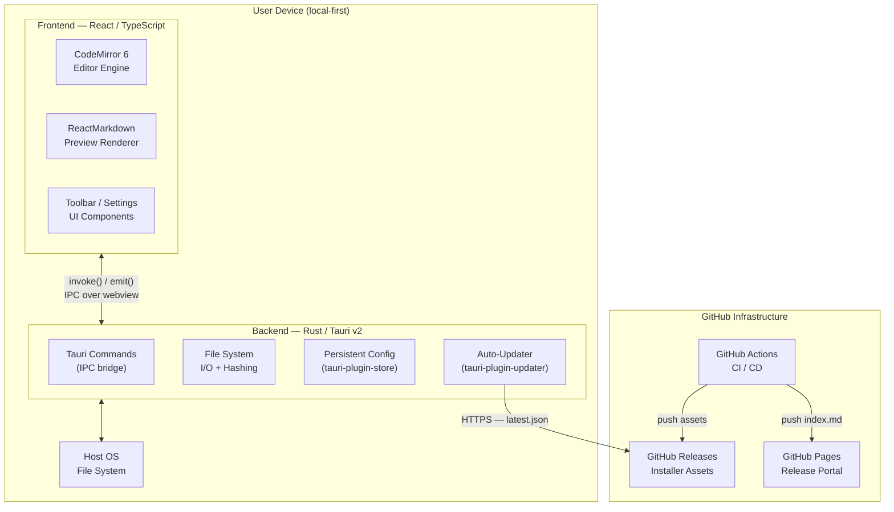
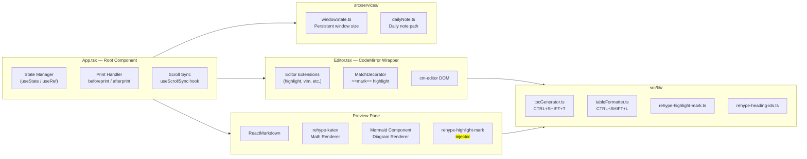
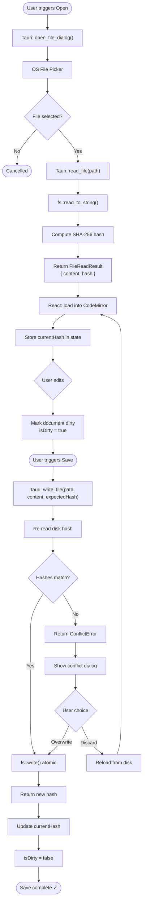
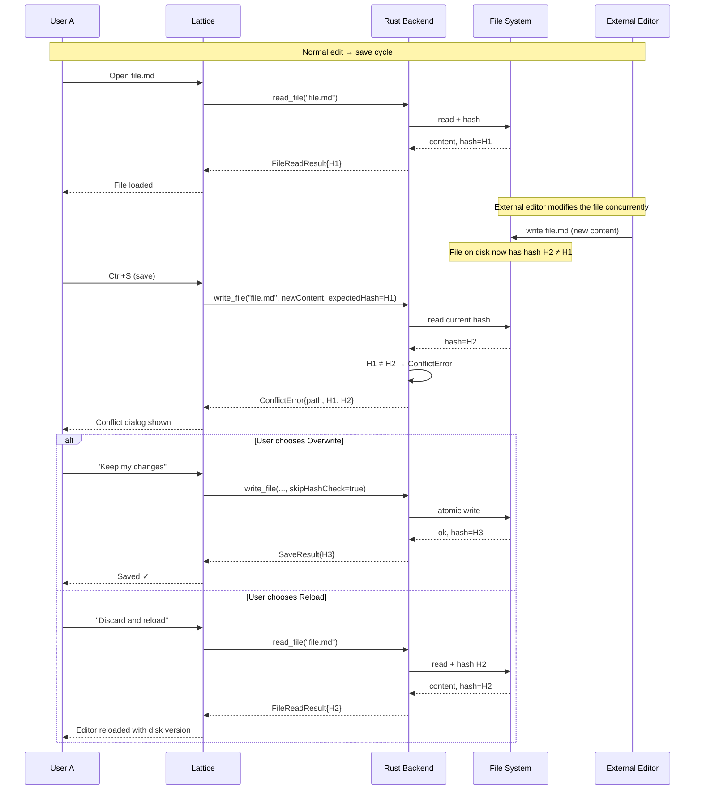
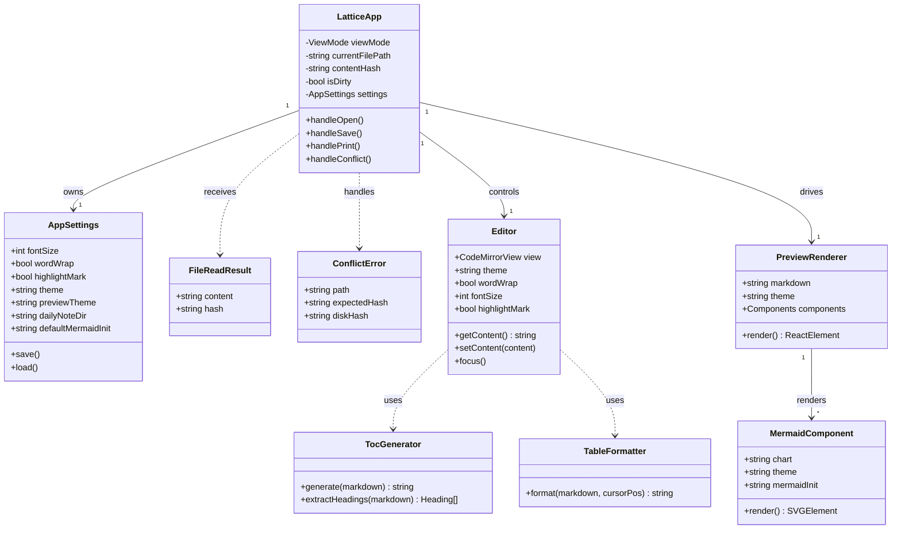
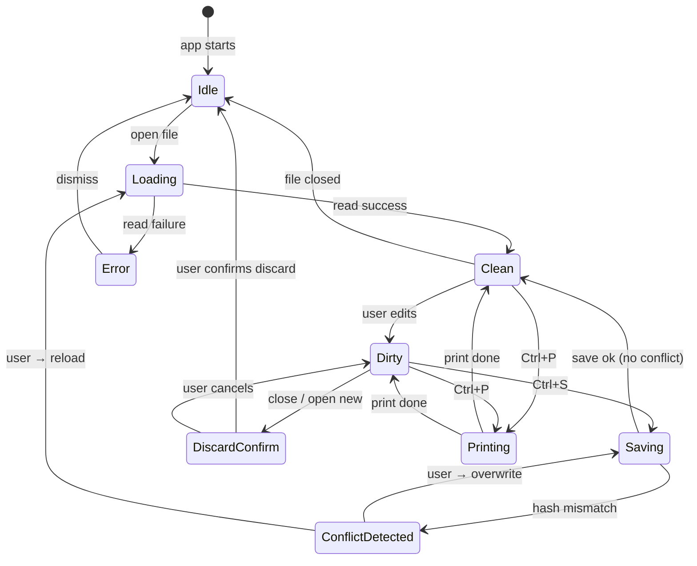
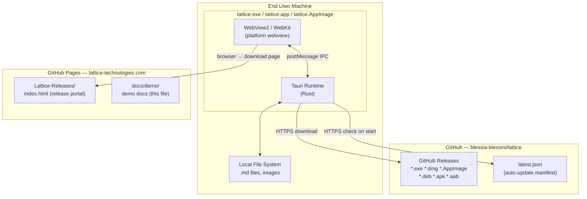
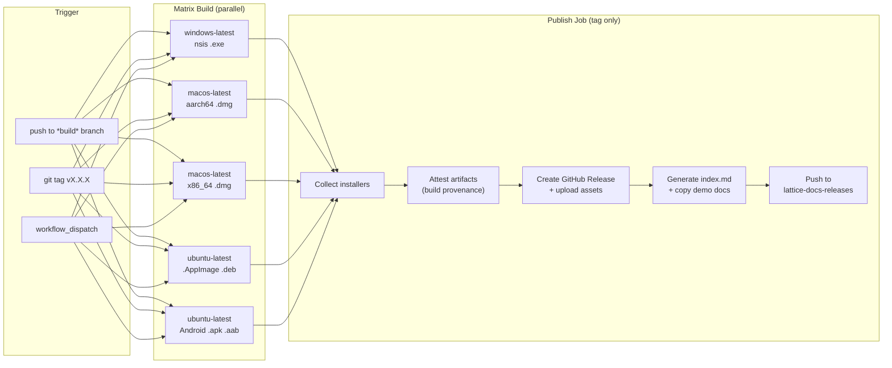
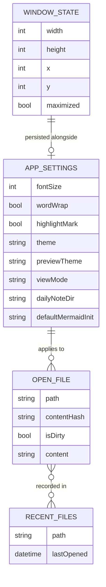

# Lattice — System Architecture
### Reference Document for Systems Engineers

> **View this file in Lattice** (Dual or Preview mode) to render all Mermaid diagrams inline.
> All diagrams follow UML conventions and are expressed as Mermaid source — they are
> ==version-controlled plain text==, diff-friendly, and editable without any drawing tool.

---

## Table of Contents

<!-- TOC -->
- [System Overview](#system-overview)
- [Component Decomposition](#component-decomposition)
- [Data Flow — File Read / Write Cycle](#data-flow--file-read--write-cycle)
- [Sequence — Conflict Detection Protocol](#sequence--conflict-detection-protocol)
- [Class Model — Core Domain](#class-model--core-domain)
- [State Machine — Editor Lifecycle](#state-machine--editor-lifecycle)
- [Deployment Diagram](#deployment-diagram)
- [CI/CD Pipeline](#cicd-pipeline)
- [Entity-Relationship — Settings & Persistence](#entity-relationship--settings--persistence)
- [Next Steps](#next-steps)
<!-- /TOC -->

---

## System Overview

Lattice is a ==local-first== desktop Markdown editor built on **Tauri v2** (Rust backend) +
**React 18** (TypeScript frontend) + **CodeMirror 6** (editor engine).

Key architectural principles:

- **No cloud dependency** — all file I/O happens through the Tauri Rust backend directly to the host OS.
- **Optimistic concurrency** — SHA-256 content hashing prevents silent data loss on concurrent external edits.
- **Single-binary distribution** — the Tauri shell bundles the React SPA into a native executable for each platform.
- **Documents as code** — `.md` files are plain text, VCS-friendly, and interoperable with any Markdown toolchain.

---

## Component Decomposition

---

## Data Flow — File Read / Write Cycle

---

## Sequence — Conflict Detection Protocol

---

## Class Model — Core Domain

---

## State Machine — Editor Lifecycle

---

## Deployment Diagram

---

## CI/CD Pipeline

---

## Entity-Relationship — Settings & Persistence

---

## Next Steps

> This section tracks outstanding architectural work. Check off items as they are completed.

- [ ] **Multi-file tabs** — design tab bar state model; determine whether tabs live in a single window or spawn new Tauri windows
- [ ] **iOS build** — provision profiles and code-signing pipeline needed; CI placeholder exists at step 360
- [ ] **Plugin / extension API** — define a safe IPC surface for third-party CodeMirror extensions
- [ ] **Encrypted at-rest storage** — evaluate `tauri-plugin-stronghold` for sensitive note vaults
- [ ] **Full-text search across files** — Rust-side index using `tantivy` or similar; expose via Tauri command
- [ ] **Collaborative editing (offline-first)** — evaluate CRDT approach (e.g. Automerge) before any network layer is introduced
- [ ] **ARM64 Windows installer** — currently skipped in CI due to cross-compilation complexity; re-evaluate with Tauri v2.1+
- [ ] **Document the IPC command surface** — generate OpenAPI-style spec from Rust `#[tauri::command]` attributes

---

*Part of the Lattice demo suite.  
See also: [Feature Showcase](demo.md) · [Physics Equations](physics-equations.md)*
