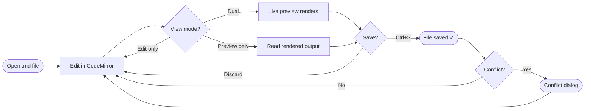
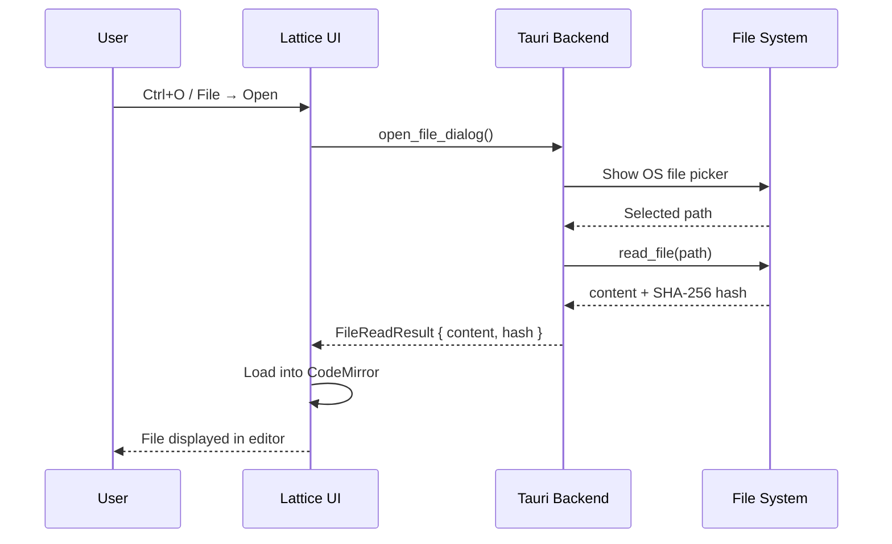
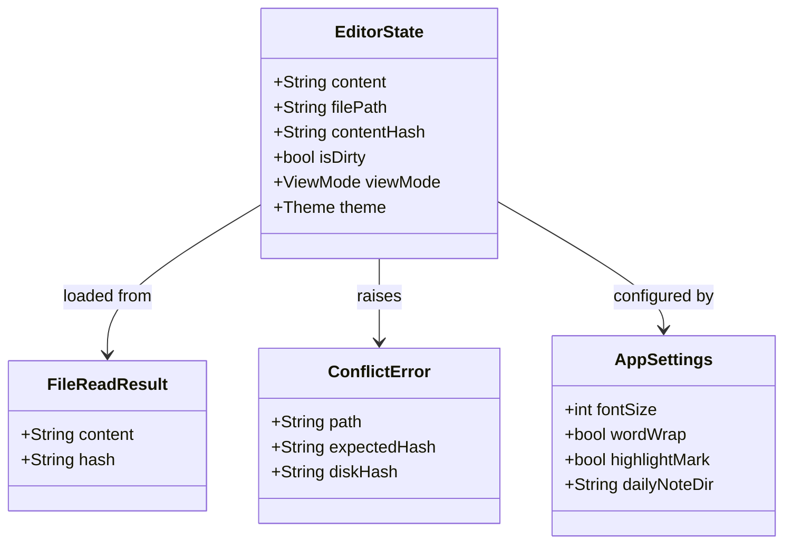
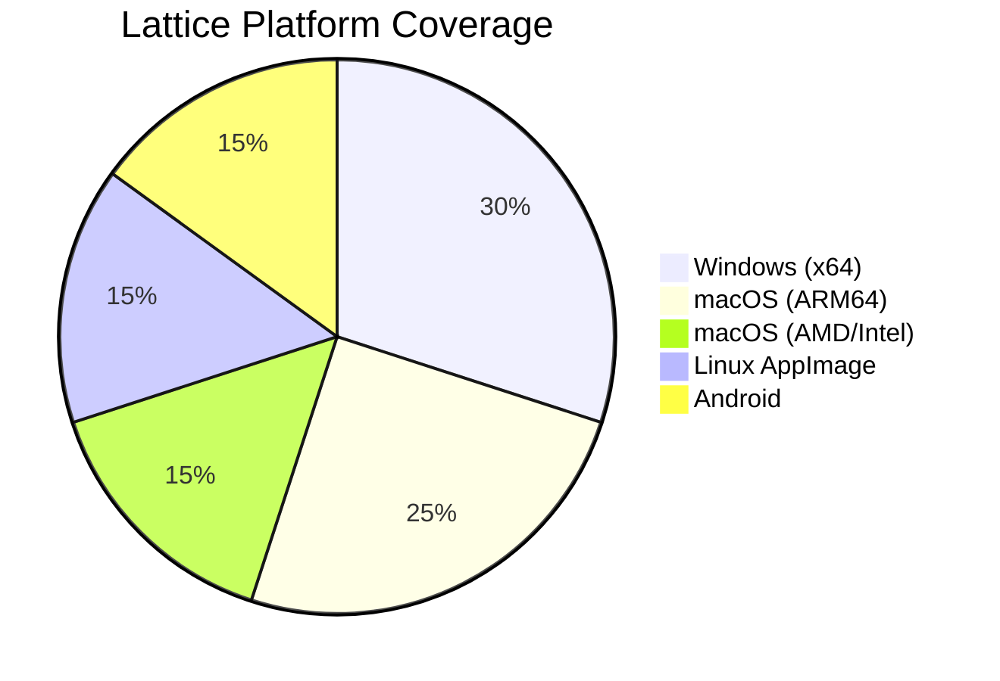
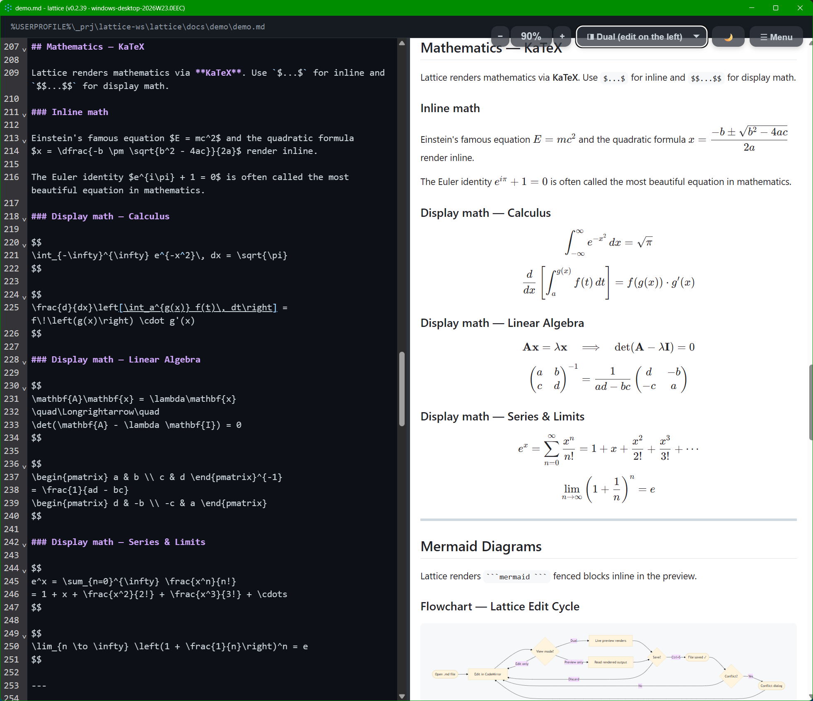
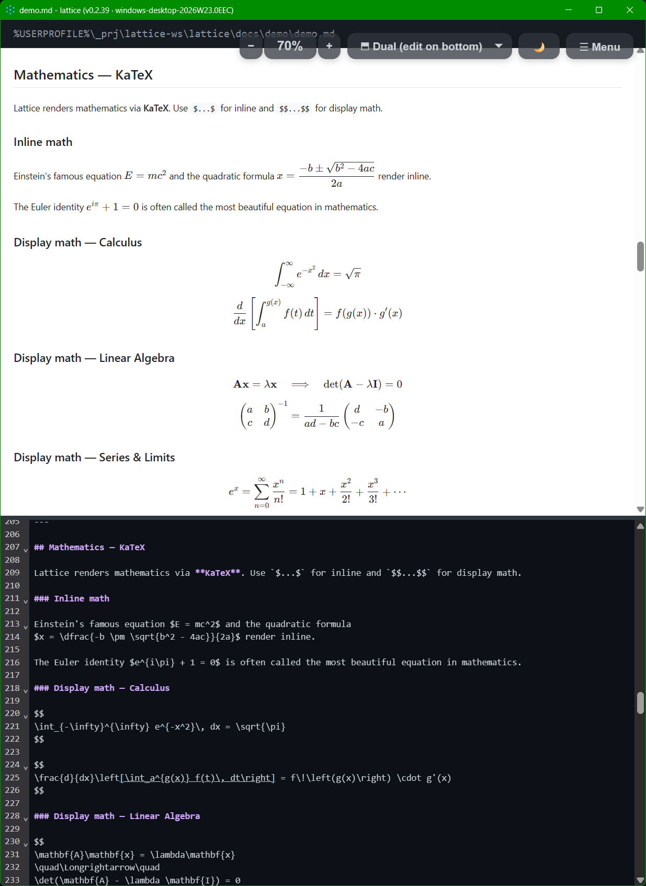

# Lattice — Feature Showcase

> **Open this file with Lattice** to see every feature rendered live.  
> Switch between **Edit**, **Preview**, and **Dual** view with the toolbar selector.  
> Try `Ctrl/Cmd+Shift+T` to auto-generate the Table of Contents below.

---

## Table of Contents

<!-- TOC -->
- [Table of Contents](#table-of-contents)
- [Text Formatting](#text-formatting)
- [Highlight Marks](#highlight-marks)
- [Lists](#lists)
  - [Unordered](#unordered)
  - [Ordered](#ordered)
  - [Definition-style (using bold + indent)](#definition-style-using-bold-indent)
- [Task Lists (GFM)](#task-lists-gfm)
- [Tables](#tables)
- [Code](#code)
  - [Inline code](#inline-code)
  - [Fenced code blocks](#fenced-code-blocks)
- [Blockquotes](#blockquotes)
  - [GitHub-style Alerts (rendered by GitHub and Lattice)](#github-style-alerts-rendered-by-github-and-lattice)
- [Mathematics — KaTeX](#mathematics-katex)
  - [Inline math](#inline-math)
  - [Display math — Calculus](#display-math-calculus)
  - [Display math — Linear Algebra](#display-math-linear-algebra)
  - [Display math — Series & Limits](#display-math-series-limits)
- [Mermaid Diagrams](#mermaid-diagrams)
  - [Flowchart — Lattice Edit Cycle](#flowchart-lattice-edit-cycle)
  - [Sequence Diagram — File Open Flow](#sequence-diagram-file-open-flow)
  - [Class Diagram — Core Data Model](#class-diagram-core-data-model)
  - [Pie Chart — Supported Platforms](#pie-chart-supported-platforms)
- [Images](#images)
- [Links](#links)
- [HTML in Markdown](#html-in-markdown)
- [Keyboard Shortcuts Reference](#keyboard-shortcuts-reference)
<!-- /TOC -->

---

## Text Formatting

Normal paragraph text flows here. Lattice renders Markdown as **close to GitHub** as possible,
so files look identical whether viewed in the editor preview, on GitHub, or printed.

| Style         | Syntax              | Result            |
| :------------ | :------------------ | :---------------- |
| Bold          | `**bold**`          | **bold**          |
| Italic        | `*italic*`          | *italic*          |
| Bold + italic | `***both***`        | ***both***        |
| Strikethrough | `~~strikethrough~~` | ~~strikethrough~~ |
| Inline code   | `` `code` ``        | `code`            |
| Superscript   | `X<sup>2</sup>`     | X<sup>2</sup>     |
| Subscript     | `H<sub>2</sub>O`    | H<sub>2</sub>O    |

> **Note — sub/superscript:** CommonMark/GFM has no native sub/superscript syntax.
> Lattice renders `<sup>` and `<sub>` HTML tags directly (GitHub and Obsidian do too).
> We recommend, though that you use alternatives that work everywhere: 
>   KaTeX math (`$X^2$` → $X^2$, `$H_2O$` → $H_2O$)
> or Unicode characters (`X²`, `H₂O`).
> The linter flags these tags as a portability hint — they may not render in all renderers.

---

## Highlight Marks

==Highlight marks== are a Lattice-exclusive feature.
Wrap any text in `==double equals==` to render it with a ==bright amber background==.

This works in **any context** — inside a sentence, ==across *italic* and **bold** spans==,
or on its own line:

==This entire sentence is highlighted.==

> [!NOTE]
> Highlight marks are **not** rendered inside code blocks or inline code — `==this stays raw==`.

---

## Lists

### Unordered

- First item
- Second item
  - Nested item A
  - Nested item B
    - Deeply nested
- Third item with **bold** and *italic* text

### Ordered

1. Install Lattice from the [releases page](https://github.com/blessia-blessini/lattice/releases)
2. Open any `.md` file — double-click or via **File → Open**
3. Choose your view:
   1. **Edit** — raw CodeMirror editor only
   2. **Preview** — rendered HTML only
   3. **Dual** — side-by-side (four layout variants)
4. Print with `Ctrl/Cmd+P` — always renders to a clean light theme

### Definition-style (using bold + indent)

**Local-first**
  All files stay on your machine. No cloud sync required.

**Documents as Code**
  Plain-text `.md` files are diff-friendly, version-controlled, and AI-ready.

---

## Task Lists (GFM)

GitHub Flavored Markdown task lists render as interactive checkboxes in Lattice.

- [x] Install Lattice
- [x] Open the demo file
- [x] Explore Edit / Preview / Dual views
- [ ] Try `Ctrl/Cmd+Shift+T` to regenerate the Table of Contents
- [ ] Try `Ctrl/Cmd+Shift+L` to auto-align a pipe table
- [ ] Paste a screenshot with `Ctrl/Cmd+V` — it auto-saves to a sibling folder
- [x] Open a second file in a new window (multi-window support)
- [ ] Try printing to PDF with `Ctrl/Cmd+P`

---

## Tables

Lattice supports **GFM pipe tables** with left, center, and right alignment.
Press `Ctrl/Cmd+Shift+L` with the cursor anywhere in the table to auto-format it.

| Feature               | Edit View | Preview View | Dual View |
| :-------------------- | :-------: | :----------: | :-------: |
| CodeMirror editor     |     ✓     |      —       |     ✓     |
| Live rendered preview |     —     |      ✓       |     ✓     |
| Scroll sync           |     —     |      —       |     ✓     |
| Print (Ctrl+P)        |     ✓     |      ✓       |     ✓     |
| ==Highlight marks==   |     ✓     |      ✓       |     ✓     |
| Mermaid diagrams      |     —     |      ✓       |     ✓     |
| KaTeX mathematics     |     —     |      ✓       |     ✓     |

---

## Code

### Inline code

Use backticks for `inline code`. Great for `file/paths`, `commands`, and `variable_names`.

### Fenced code blocks

Lattice passes code fences to the preview unchanged — syntax highlighting is provided by the renderer.

```typescript
// Lattice highlight-mark plugin — converts ==text== to <mark> elements
export const MARK_RE = /==((?:[^=\n]|=(?!=))+?)==/g;

export function splitAtMarks(text: string): HastNode[] {
  const parts: HastNode[] = [];
  let lastIndex = 0;
  MARK_RE.lastIndex = 0;
  let match: RegExpExecArray | null;
  while ((match = MARK_RE.exec(text)) !== null) {
    if (match.index > lastIndex)
      parts.push({ type: 'text', value: text.slice(lastIndex, match.index) });
    parts.push({
      type: 'element', tagName: 'mark',
      properties: {},
      children: [{ type: 'text', value: match[1] }],
    });
    lastIndex = match.index + match[0].length;
  }
  if (lastIndex < text.length)
    parts.push({ type: 'text', value: text.slice(lastIndex) });
  return parts;
}
```

```rust
// Tauri command — read file with conflict detection
#[tauri::command]
pub async fn read_file(path: String) -> Result<FileReadResult, String> {
    let content = fs::read_to_string(&path)
        .map_err(|e| format!("Cannot read {path}: {e}"))?;
    let hash = compute_sha256(&content);
    Ok(FileReadResult { content, hash })
}
```

```bash
# Build a production release
export LATTICEBUILD_NO="MyBuild-001"
npm run tauri build
```

---

## Blockquotes

> **Single-level blockquote.** Great for callouts, citations, or side notes.

> Nested blockquotes are also supported:
>
> > Inner quote — *"Documents as code, not documents as data."*
> >
> > — Lattice design philosophy

### GitHub-style Alerts (rendered by GitHub and Lattice)

> [!NOTE]
> Useful information that users should know, even when skimming.

> [!TIP]
> Optional advice for a better experience.

> [!IMPORTANT]
> Key information users need to know to achieve their goal.

> [!WARNING]
> Urgent information that needs immediate attention.

> [!CAUTION]
> Advises about risks or negative outcomes.

---

## Mathematics — KaTeX

Lattice renders mathematics via **KaTeX**. Use `$...$` for inline and `$$...$$` for display math.

### Inline math

Einstein's famous equation $E = mc^2$ and the quadratic formula
$x = \dfrac{-b \pm \sqrt{b^2 - 4ac}}{2a}$ render inline.

The Euler identity $e^{i\pi} + 1 = 0$ is often called the most beautiful equation in mathematics.

### Display math — Calculus

$$
\int_{-\infty}^{\infty} e^{-x^2}\, dx = \sqrt{\pi} 
$$

$$
\frac{d}{dx}\left[\int_a^{g(x)} f(t)\, dt\right] = f\!\left(g(x)\right) \cdot g'(x)
$$

### Display math — Linear Algebra

$$
\mathbf{A}\mathbf{x} = \lambda\mathbf{x}
\quad\Longrightarrow\quad
\det(\mathbf{A} - \lambda \mathbf{I}) = 0
$$

$$
\begin{pmatrix} a & b \\ c & d \end{pmatrix}^{-1}
= \frac{1}{ad - bc}
\begin{pmatrix} d & -b \\ -c & a \end{pmatrix}
$$

### Display math — Series & Limits

$$
e^x = \sum_{n=0}^{\infty} \frac{x^n}{n!}
= 1 + x + \frac{x^2}{2!} + \frac{x^3}{3!} + \cdots
$$

$$
\lim_{n \to \infty} \left(1 + \frac{1}{n}\right)^n = e
$$

---

## Mermaid Diagrams

Lattice renders ` ```mermaid ``` ` fenced blocks inline in the preview.

### Flowchart — Lattice Edit Cycle



### Sequence Diagram — File Open Flow



### Class Diagram — Core Data Model



### Pie Chart — Supported Platforms



---

## Images

Paste images directly into Lattice with `Ctrl/Cmd+V`.  
The image file is automatically saved to a sibling folder named after the current document,
and a Markdown reference is inserted at the cursor position:

```markdown

  
  
  
  
```

  **Here is how it renders in `Dual (edit on the left)` mode**:

  

  **Here is how it renders in `Dual (edit on the bottom)` mode**: 

  

> **Tip:** The assets folder name is derived from the document filename, keeping related
> files grouped together and easy to version-control.


---

## Links

- [Lattice on GitHub](https://github.com/blessia-blessini/lattice) — source code and issue tracker
- [Releases Page](https://github.com/blessia-blessini/lattice/releases) — download installers
- [Release Site](https://lattice-technologies.com/Lattice-Releases/) — GitHub Pages release portal
- Relative link: [System Architecture Demo](system-architecture.md)
- Relative link: [Physics Equations Demo](physics-equations.md)

Auto-link: https://github.com/blessia-blessini/lattice

---

## HTML in Markdown

Lattice renders a **safe whitelist** of inline HTML tags and passes everything else
through as literal text.  The linter flags all inline HTML — whitelisted tags get a
**hint** (portability risk), non-whitelisted tags get a **warning** (not rendered here).

| HTML element | Lattice preview        | GitHub | Portable alternative                          |
| :----------- | :--------------------- | :----- | :-------------------------------------------- |
| `<sup>`      | ✅ rendered            | ✅     | KaTeX: `$X^2$` → $X^2$ · Unicode: `X²`       |
| `<sub>`      | ✅ rendered            | ✅     | KaTeX: `$H_2O$` → $H_2O$ · Unicode: `H₂O`   |
| `<kbd>`      | ✅ rendered            | ✅     | Inline code: `` `Ctrl+S` ``                   |
| `<br>`       | ✅ rendered            | ✅     | Two trailing spaces or blank line             |
| `<mark>`     | ⚠️ plain text          | ✅     | `==highlight==` (Lattice-native)              |
| `<details>`  | ⚠️ plain text          | ✅     | Headings + TOC (no universal equivalent)      |
| Other HTML   | ⚠️ plain text          | varies | Markdown equivalent (case-by-case)            |

Live examples of the whitelisted tags:

- Superscript: X<sup>2</sup> + Y<sup>3</sup>
- Subscript: H<sub>2</sub>O and CO<sub>2</sub>
- Keyboard: press <kbd>Ctrl</kbd>+<kbd>S</kbd> to save

---

## Keyboard Shortcuts Reference

| Action                     | Windows / Linux         | macOS                  |
| :------------------------- | :---------------------- | :--------------------- |
| Save                       | <kbd>Ctrl+S</kbd>       | <kbd>Cmd+S</kbd>       |
| Open file                  | <kbd>Ctrl+O</kbd>       | <kbd>Cmd+O</kbd>       |
| New window                 | <kbd>Ctrl+N</kbd>       | <kbd>Cmd+N</kbd>       |
| Generate / refresh TOC     | <kbd>Ctrl+Shift+T</kbd> | <kbd>Cmd+Shift+T</kbd> |
| Auto-align table           | <kbd>Ctrl+Shift+L</kbd> | <kbd>Cmd+Shift+L</kbd> |
| Paste image from clipboard | <kbd>Ctrl+V</kbd>       | <kbd>Cmd+V</kbd>       |
| Print / Save as PDF        | <kbd>Ctrl+P</kbd>       | <kbd>Cmd+P</kbd>       |
| Increase font size         | <kbd>Ctrl++</kbd>       | <kbd>Cmd++</kbd>       |
| Decrease font size         | <kbd>Ctrl+-</kbd>       | <kbd>Cmd+-</kbd>       |
